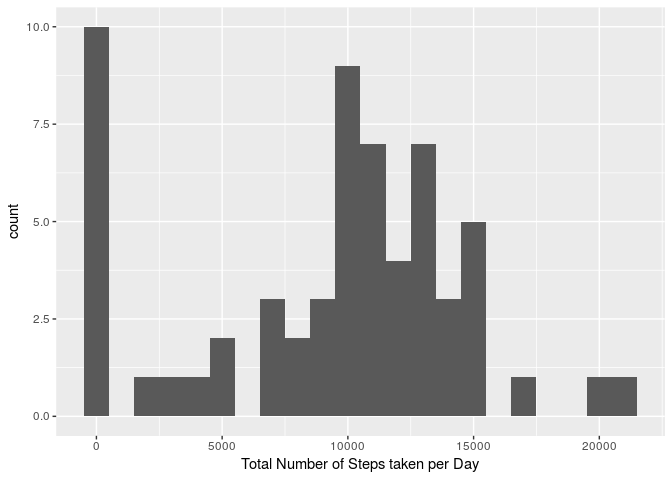
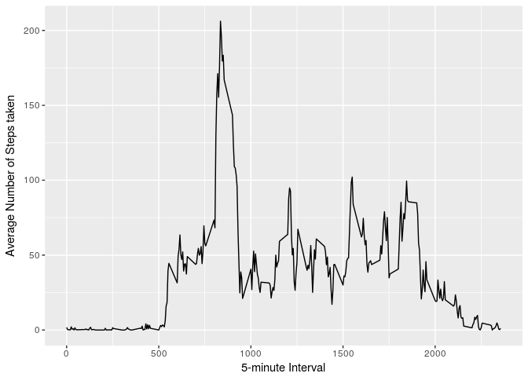
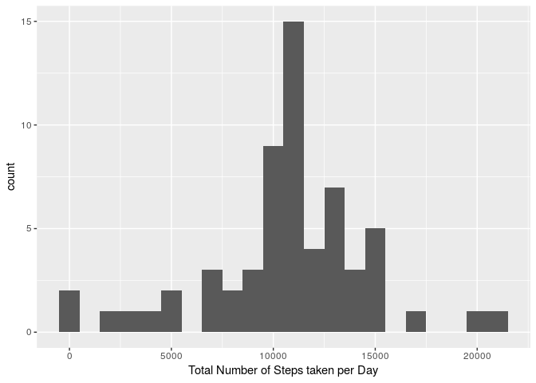
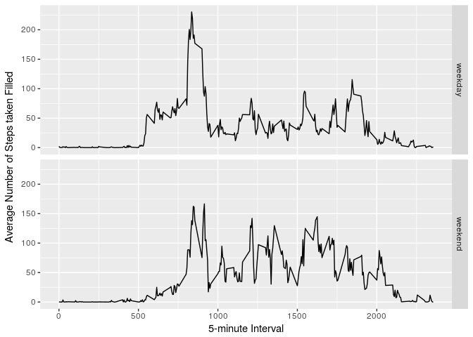

# Reproducible Research: Peer Assessment 1

## Loading and preprocessing the data


```r
library("dplyr")
```

```
## 
## Attaching package: 'dplyr'
```

```
## The following objects are masked from 'package:stats':
## 
##     filter, lag
```

```
## The following objects are masked from 'package:base':
## 
##     intersect, setdiff, setequal, union
```

```r
library("lubridate")
```

```
## 
## Attaching package: 'lubridate'
```

```
## The following object is masked from 'package:base':
## 
##     date
```

```r
library("ggplot2")

## Create the data frame as 'df':
df <- read.csv("activity.csv")
df$date <- lubridate::ymd(df$date)
```

## What is mean total number of steps taken per day?

### aggregate:


```r
dfGroup <- df %>% group_by(date)
stepsPerDay <- summarise(dfGroup, sum(steps, na.rm = T))
```

### 1. plot histogram:


```r
qplot(stepsPerDay$`sum(steps, na.rm = T)`, binwidth = 1000,
      xlab = "Total Number of Steps taken per Day")
```

<!-- -->

### 2. mean & medium:


```r
mean(stepsPerDay$`sum(steps, na.rm = T)`, na.rm = T)
```

```
## [1] 9354.23
```

```r
median(stepsPerDay$`sum(steps, na.rm = T)`, na.rm = T)
```

```
## [1] 10395
```

## What is the average daily activity pattern?


```r
# aggregate:
dfGroupAvg <- df %>% group_by(interval)
avgSteps <- summarise(dfGroupAvg, mean(steps, na.rm = T))
```

### 1. plot time series:


```r
ggplot(data=avgSteps, aes(x=interval, y=avgSteps$`mean(steps, na.rm = T)`)) +
  geom_line() +
  xlab("5-minute Interval") +
  ylab("Average Number of Steps taken")
```

<!-- -->

### 2. max number of steps:


```r
avgSteps[which.max(avgSteps$`mean(steps, na.rm = T)`),]
```

```
## # A tibble: 1 x 2
##   interval `mean(steps, na.rm = T)`
##      <int>                    <dbl>
## 1      835                 206.1698
```

## Inputing missing values


```r
# 1. Assuming we're looking for NAs in all columns of 'df':
nrow(subset(df, is.na(df$steps)|is.na(df$date)|is.na(df$interval)))
```

```
## [1] 2304
```

### 2. & 3. Create new dataset with NAs filled by mean of corresponding 5-min interval:


```r
dfFilled <- df %>%
  group_by(interval) %>% 
  mutate(steps = ifelse(is.na(steps), mean(steps, na.rm = T), steps))
```

### Aggregate again:


```r
dfGroupNa <- dfFilled %>% group_by(date)
stepsPerDayNa <- summarise(dfGroupNa, sum(steps, na.rm = T))
```

### 4. plot histogram + mean & medium updated:


```r
qplot(stepsPerDayNa$`sum(steps, na.rm = T)`, binwidth = 1000,
      xlab = "Total Number of Steps taken per Day")
```

<!-- -->


```r
mean(stepsPerDayNa$`sum(steps, na.rm = T)`, na.rm = T)
```

```
## [1] 10766.19
```

```r
median(stepsPerDayNa$`sum(steps, na.rm = T)`, na.rm = T)
```

```
## [1] 10766.19
```

Mean and median values are higher after filling the missing data. The reason is,
in the original data, there are some days with `steps` values `NA` for 
a given `interval`. The total # of steps in such days are set to 0 by
default. However, after replacing missing `steps` values with the mean `steps`
of the corresponding `interval`, these 0 values are removed from the total number
of steps taken each day.

## Are there differences in activity patterns between weekdays and weekends?

### 1. Add weekdays and weeknights column to dfFilled:


```r
wDayVsWEnd <- function(date) {
  day <- weekdays(date)
  if (day %in% c("Monday", "Tuesday", "Wednesday", "Thursday", "Friday"))
    return("weekday")
  else if (day %in% c("Saturday", "Sunday"))
    return("weekend")
  else
    stop(NA)
}

dfFilled[,"day"] <- sapply(dfFilled$date, FUN = wDayVsWEnd)
```

### 2. Plot average steps taken on weekdays and weekends respective vs 5 min intervals:

### Aggregate for a last time:


```r
dfGroupAvgFill <- dfFilled %>% group_by(interval, day)
avgStepsFill <- summarise(dfGroupAvgFill, mean(steps))
```

### Plot time series weekday vs weekend:


```r
ggplot(data=avgStepsFill, aes(interval, `mean(steps)`))  +
  geom_line() +
  facet_grid(day ~ .) +
  xlab("5-minute Interval") +
  ylab("Average Number of Steps taken Filled")
```

<!-- -->

That's a wrap, folks!
